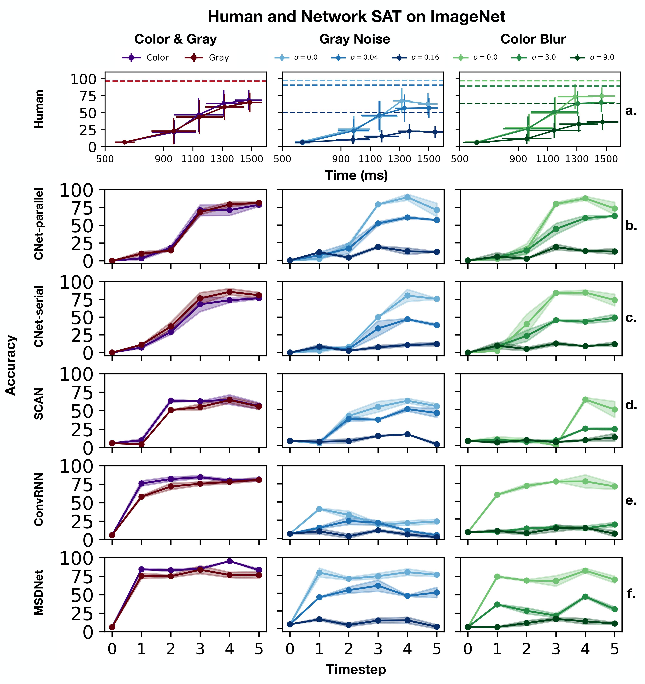

# SATBench: Benchmarking the speed-accuracy tradeoff in object recognition by humans and dynamic neural networks

**This repository contains code used in the paper:**

"SATBench: Benchmarking the speed-accuracy tradeoff in object recognition by humans and dynamic neural networks" by Ajay Subramanian, Omkar Kumbhar, Elena Sizikova, Najib J. Majaj, Denis G. Pelli (New York University, 2022).

Our contributions are as follows:
* We present large-scale (148 human observers), public dataset on timed ImageNet [1] object recognition with 16 categories, across color, grayscale, 3 noise and 3 blur conditions. For each condition, we tested human performance for 5 reaction time (RT) values. This data provides a benchmark for the human speed-accuracy tradeoff and is specifically intended to facilitate comparison between neural networks and humans on timed object recognition.
* We present comparable benchmarks for dynamic neural networks, a class of networks capable of inference-time adaptive computation.
* We perform an extensive quantitative comparison between speed-accuracy tradeoffs in humans and four dynamic neural networks. To do so, we propose three novel metrics: RMSE between SAT curves, category-wise correlation, and steepness which ease model-human comparison.

## Table of Contents
1. Dataset
2. Code
3. Usage examples
4. Pretrained models
5. Citation

## Dataset
Our human dataset is collected using a reaction time paradigm proposed by McElree & Carrasco [2] where observers are forced to respond at a beep which sounds at a specific time after target presentation. Varying the beep interval across several blocks helps us collect object recognition data across different reaction times (`500ms`, `900ms`, `1100ms`, `1300ms`, `1500ms`). We evaluate dynamic neural networks using the same paradigm with computational FLOPs used as an analog for reaction time.

Human dataset and network results can be found at https://osf.io/2cpmb/. The `human_data_analysis/` directory above contains code for analysis and visualization of human data across all experimental conditions.

## Code
We benchmark 4 dynamic neural network models - MSDNet [2] , SCAN [3], Cascaded-Nets (CNets) [4]  and ConvRNN [3] on our dataset. The following table mentions the scripts to be used for training and inference of each model. We used code for each model from existing/official implementations (links given below):

MSDNet: https://github.com/kalviny/MSDNet-PyTorch

SCAN: https://github.com/ArchipLab-LinfengZhang/pytorch-scalable-neural-networks

ConvRNN: https://github.com/cjspoerer/rcnn-sat

Code for each model is available in a subdirectory with the model's name. Documentation, instructions for training and inference and links to pretrained models are provided in separate README files for each model.

## Citations
If you use any of the data or code in our repository, please cite us as follows:

## Reference
[1] Russakovsky, O., Deng, J., Su, H., Krause, J., Satheesh, S., Ma, S., ... & Fei-Fei, L. (2015). Imagenet large scale visual recognition challenge. International journal of computer vision, 115(3), 211-252.

[2] Huang, G., Chen, D., Li, T., Wu, F., Van Der Maaten, L., & Weinberger, K. Q. (2017). Multi-scale dense networks for resource efficient image classification. arXiv preprint arXiv:1703.09844.

[3] Zhang, L., Tan, Z., Song, J., Chen, J., Bao, C., & Ma, K. (2019). Scan: A scalable neural networks framework towards compact and efficient models. Advances in Neural Information Processing Systems, 32.

[4] Iuzzolino, M., Mozer, M. C., & Bengio, S. (2021). Improving Anytime Prediction with Parallel Cascaded Networks and a Temporal-Difference Loss. Advances in Neural Information Processing Systems, 34.

[5] Spoerer, C. J., Kietzmann, T. C., Mehrer, J., Charest, I., & Kriegeskorte, N. (2020). Recurrent neural networks can explain flexible trading of speed and accuracy in biological vision. PLoS computational biology, 16(10), e1008215.
